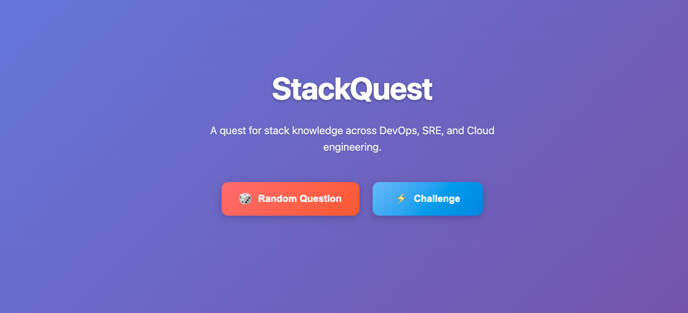

# StackQuest 🚀

A quest for stack knowledge across DevOps, SRE, and Cloud engineering.

## Features

- 📚 **Curated Questions**: High-quality questions across 12+ categories
- ⚡ **Hands-on Challenges**: Practical DevOps scenarios
- 🎯 **Category Selection**: Choose specific topics to focus on
- 🔄 **Session Tracking**: Prevents question repetition
- 📱 **Responsive Design**: Works on desktop and mobile
- 🚀 **Auto Deployment**: GitHub Actions + GitHub Pages

## Content Structure

### Random Questions
Browse questions by category:
- [Linux 🐧](Random-Questions/linux.md)
- [Networking 🌐](Random-Questions/networking.md)
- [Git](Random-Questions/git.md)
- [Cloud ☁️](Random-Questions/aws.md) (AWS & Azure)
- [Terraform 🏗️](Random-Questions/terraform.md)
- [Docker 🐳](Random-Questions/docker.md)
- [Kubernetes 🎻](Random-Questions/kubernetes.md)
- [Config Management 🔧](Random-Questions/config-management.md)
- [CI/CD 🔄](Random-Questions/cicd.md)
- [DevOps 🛠️](Random-Questions/devops.md)
- [System Design 🍥](Random-Questions/system-design.md)
- [Security 🔒](Random-Questions/security.md)

### Challenges
Practice with hands-on challenges:
- [DevOps Challenges](Challenge/devops-challenges.md)
- [SRE Challenges](Challenge/SRE-challenge.md)
- [AWS Challenges](Challenge/aws-challenge.md)
- [Kubernetes Challenges](Challenge/kubernetes-challenge.md)

## Contributing

Help us grow the knowledge base! Contribute by:
- Adding new questions and answers to specific category files in `Random-Questions/`
- Adding new challenges to specific challenge files in `Challenge/`
- Improving existing content
- Creating new category files for additional topics

Simply raise a Pull Request with your contributions.

## Deployment

This site is automatically deployed using GitHub Actions to GitHub Pages whenever changes are pushed to the main branch.
